# API
In dit vak bouwen we een web-app die server-side gerenderd is met astro en moet gebruik maken van minimaal één content api en twee web api's

## Week 1 | 01-04-2026 woensdag
### Wat heb ik vandaag gedaan?

Vandaag was het introductie van API en de workshop van astro. Verder heb ik gebrainstormed over het concept en een moodboard en lo-fi concept gemaakt.

### Mijn concept

Ik wil een site maken waar je je naam invult en een stemming kiest en daaruit krijg je dan een pokemon en schilderij aan toegewezen die daarbij hoort en een film die je kan kijken. Dit wordt gezet op een soort ID/visite kaartje in het thema van de stemming en dan als je een foto wilt nemen dan kan dat ook met een overlay van de pokemon als een soort photobooth. 

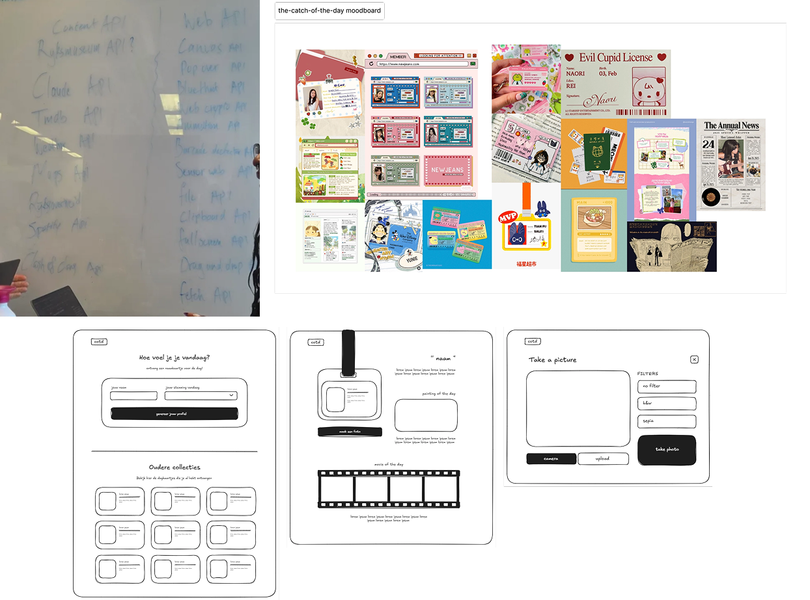

<strong>links en api's</strong>
- pokemon api
- omdb
- https://pokeapi.co/
- https://data.rijksmuseum.nl/
- https://codepen.io/dcalano/details/eYRbRQQ
- customizable select codepen
- ttps://codepen.io/collection/BNZjPe

### extra
web speech api
web ai prompt api

## Week 1 | 02-04-2026 donderdag (gesprek + wekelijkse reflectie)
### Wat heb ik vandaag gedaan?
Vandaag hadden we ook de eerste voorgangsgesprekken voor hcd en api hierbij heb ik een paar tips gekregen voor de content api's die ik kan gebruiken voor mijn site.

- codepen navigator.getmedia user api
- dialog & canvas api

Deze week zijn we dus begonnen met astro en ik had vorig jaar voor project ook al een klein beetje gewerkt met node.js en api's, maar het is allemaal al wel weggezakt en ik vond dit vorig jaar ook al best lastig. Ik kijk wel uit naar het maken van de web-app, maar ik twijfel ook nog wel want ik vind dit ook behoorlijk moeilijk.

## Week 2 | 08-04-2026 woensdag
### Wat heb ik vandaag gedaan?

- Wat heb ik vandaag gedaan?

Vandaag hadden we de workshop met Astro en de dynamic pages. Daarna heb ik vandaag niet heel veel gedaan… ik ben begonnen met het stylen van de header en basis css opstellen. Ook was ik bezig met de content api van pokemon erin te laden. Het is me wel gelukt om de pokemons te fetchen, maar ben nog bezig om ze in de site te zetten.

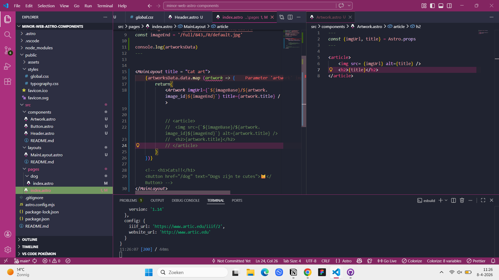
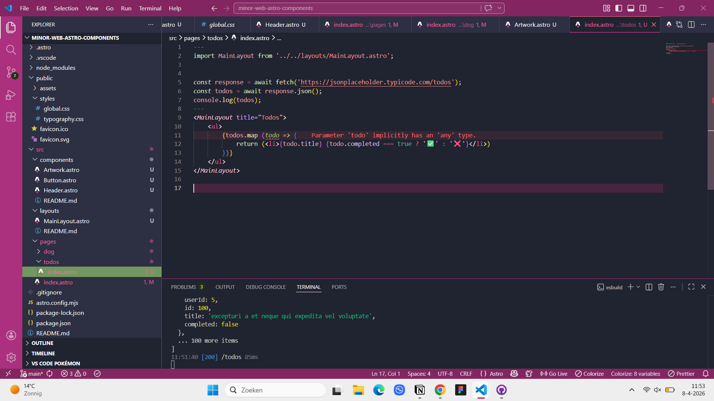
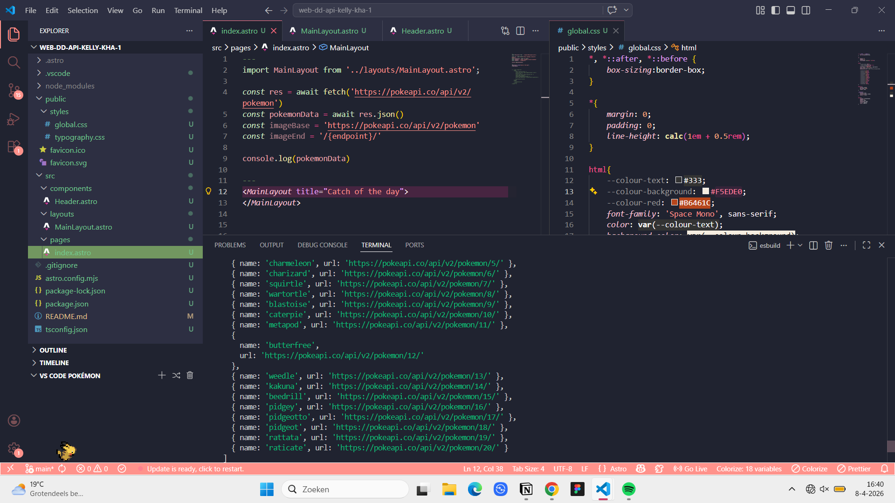

## Week 2 | 09-04-2026 donderdag
### Wat heb ik vandaag gedaan?
Vandaag ben ik verder gegaan met de styling en heb de api op de website ingeladen met de foto’s. Ook heb ik de navigatie responsive gemaakt voor mobiel. 

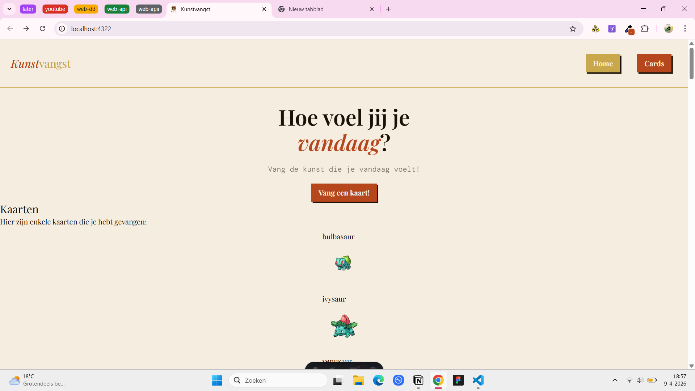
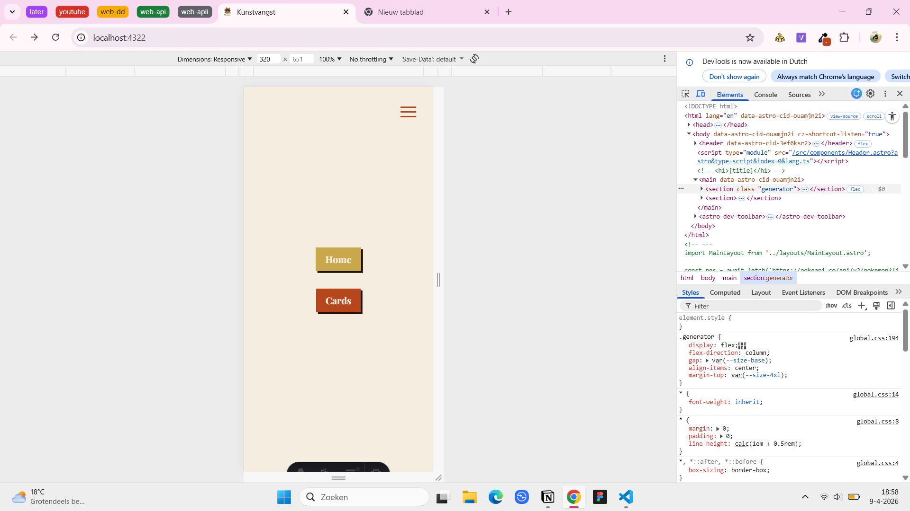
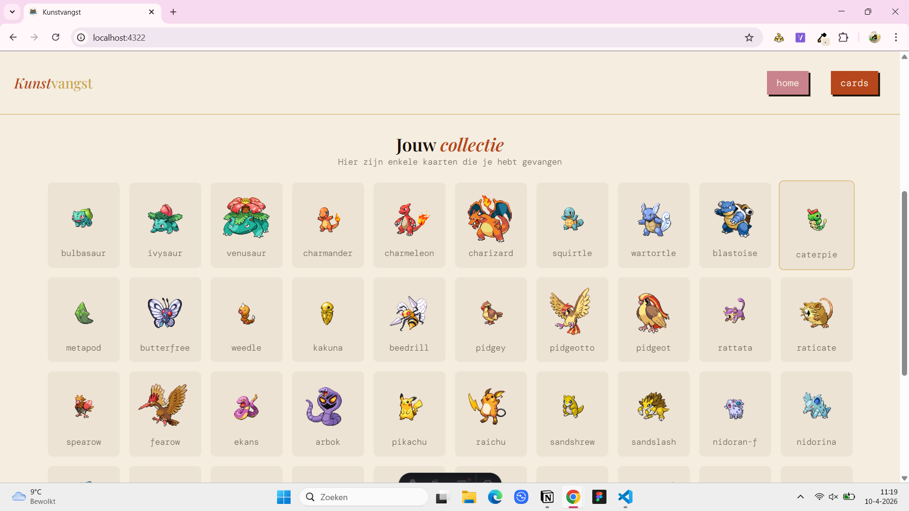

## Week 2 | 10-04-2026 vrijdag (voortgangsgesprekken + wekelijkse reflectie)
Ik ben heel blij dat het mij is gelukt om de api's in te laden en ik ben ook bezig geweest met de styling aangezien dit mij heel erg motiveert om verder te werken. Ik zou nu graag verder willen gaan met de detailpagina, maar ik vind het nog een beetje moeilijk om in te zien hoe ik het moet aanpakken. 

## Week 3 | 15-04-2026 woensdag
### Wat heb ik vandaag gedaan?
Vandaag ben ik aan de slag geweest met de detailpagina. Ik heb een component gemaakt van de id card en deze laad ik in op de detailpagina. Ook ben ik begonnen met de photobooth, dit heb ik gedaan met de navigator.getmedia en canvas api.

Het kostte me wel een tijdje om te zien hoe ik de id-card wilde maken.

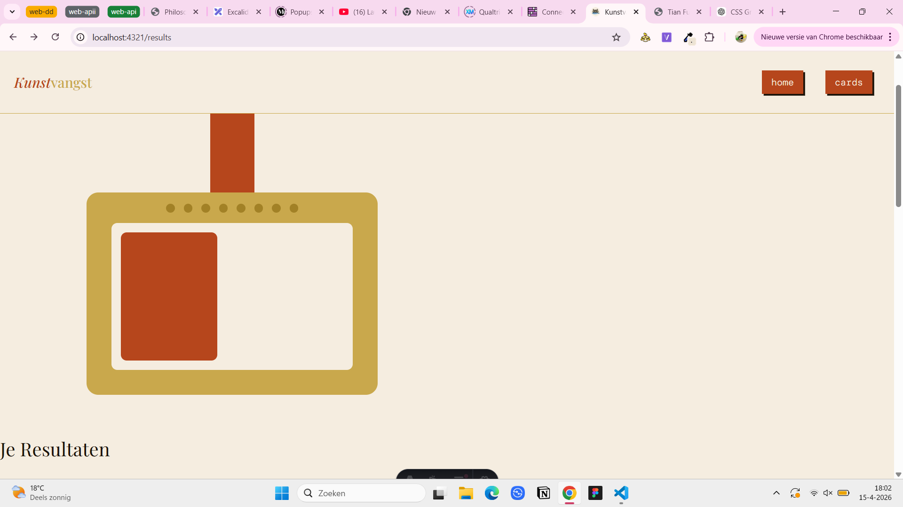
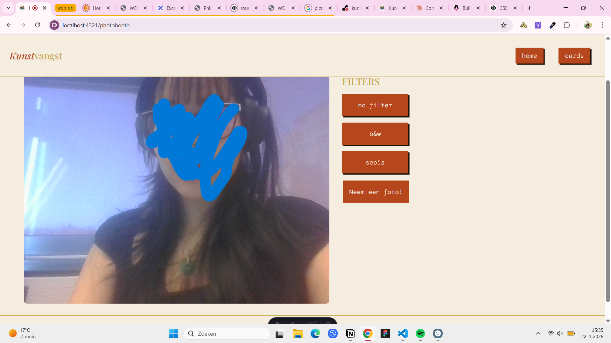

## Week 3 | 16-04-2026 donderdag
### Wat heb ik vandaag gedaan?
Ik heb vandaag de styling van de id card verbetert met shadows. Ook ben ik bezig geweest met een loading animation. Wanneer de pagina laadt gaat de card in een cirkel van linksboven naar beneden draaien. Dit heb ik samen met Cyd gedaan, want het lukte mij eerst niet om de positie goed te krijgen. 

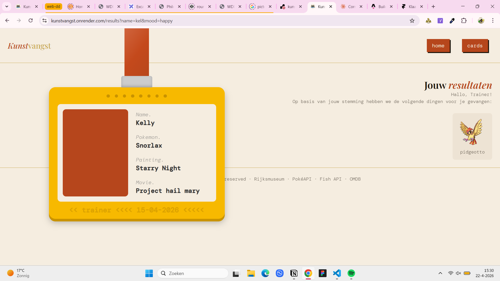

## Week 4 | 22-04-2026 woensdag
### Wat heb ik vandaag gedaan?

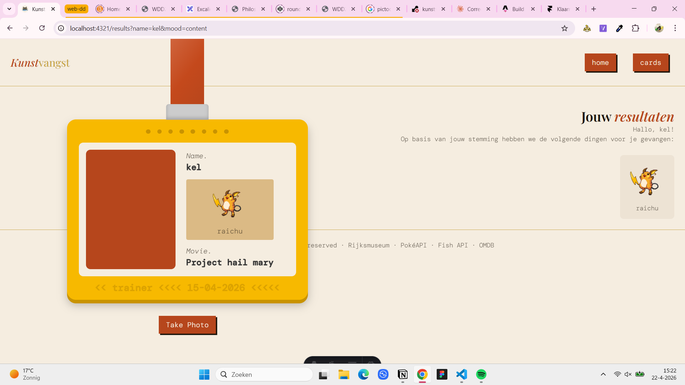

- de website met render online gezet
    - [https://dashboard.render.com/web/srv-d7k7qlreo5us73837q7g/deploys/dep-d7k7qmjeo5us73837qh0?r=2026-04-22%4007%3A47%3A42~2026-04-22%4007%3A50%3A30](https://dashboard.render.com/web/srv-d7k7qlreo5us73837q7g/deploys/dep-d7k7qmjeo5us73837qh0?r=2026-04-22%4007%3A47%3A42%7E2026-04-22%4007%3A50%3A30)https://kunstvangst.onrender.com/results?name=kel&mood=happy
    - [https://kunstvangst.onrender.com](https://kunstvangst.onrender.com/results?name=kel&mood=happy)
- de pokemon in de kaart en op de site zijn nu gelijk met de local storage
- de pokemons zijn nu ook ingedeeld op mood
- waarmee bezig? de photobooth (local storage) & film api op result page

## Week 4 | 23-04-2026 donderdag
### Wat heb ik vandaag gedaan?
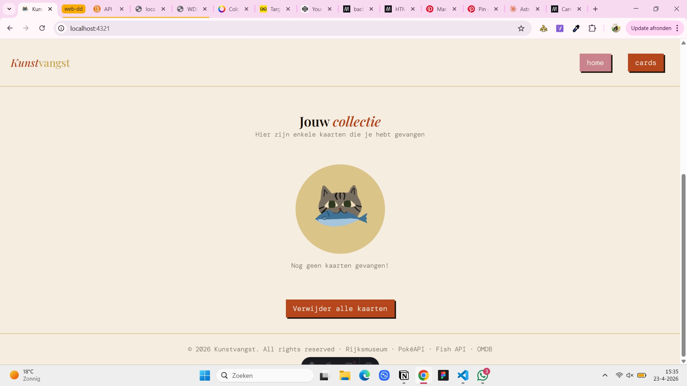
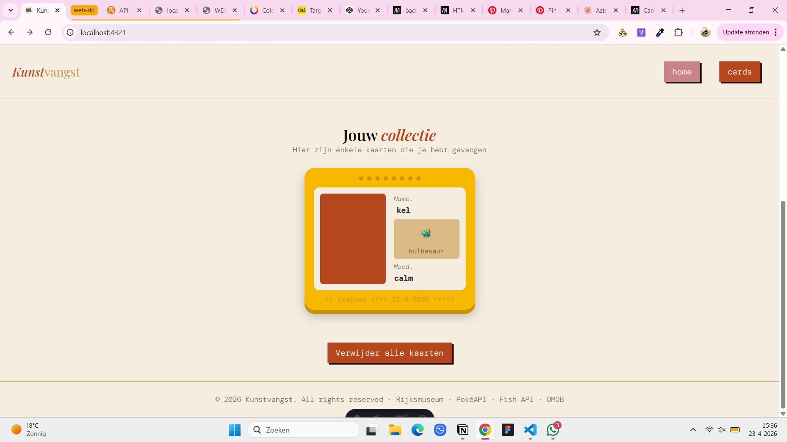
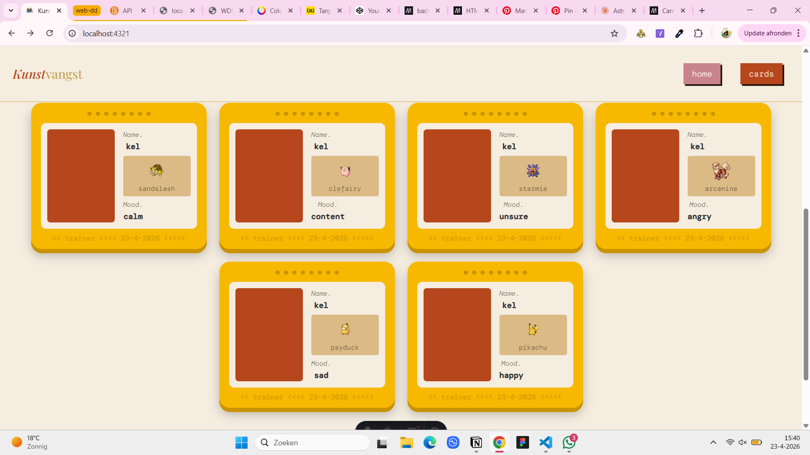
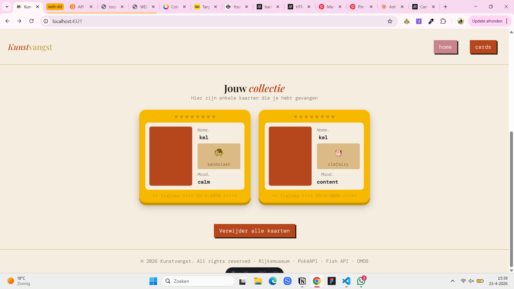

Ik heb de cards met local storage gedaan en nu als je een kaart krijgt dan komt de kaart op de homepage. Deze kaartje worden met javascript gemaakt met de data vanuit de local storage. Wanneer je nog geen kaartje hebt is er een empty state en je kan ook alle kaartjes verwijderen met de localstorage clear. Ook als je nog een kaartje vangt dan onthoud hij alleen de eerste behalve als je een andere stemming doet. 

- Wat ga ik morgen doen?
    - individuele kaartjes verwijderen
    - 1 kaartje per stemming
    - verschillende kleuren per stemming

## Week 4 | 4-04-2026 vrijdag (voortgangsgesprek en wekelijkse reflectie)
Ik vind de local storage nog wel een beetje moeilijk, want ik was er niet bij de workshop maar ik denk dat ik het wel onder de knie begin te krijgen. Ook was het nog behoorlijk uitzoeken hoe dynamic paging werkte met het doorgeven van de namen naar de resultpagina. Ik heb deze week wel grote stappen vooruit gezet en ik ben wel blij dat alles redelijk goed lukt. Ik zou graag nog wel verschillende stemmingen willen en dat de pokemons daadwerklijk verschijnen op de kaart. Ook zou ik willen dat je vanuit de homepage op een kaartje kan klikken en dat het dan ook leidt naar de pagina. 

Er moet nog best wel veel gebeuren net zoals bij de photobooth dat hij ook de foto meeneemt en de filters.

## vakantie
### Wat heb ik vandaag gedaan?
In de vakantie ben ik aan de slag geweest met de individuele styling van elke mood en deze hebben ik ook aangegeven in de resultspage. Ook heb ik de image van de api toegevoegd aan het kaartje zelf. 

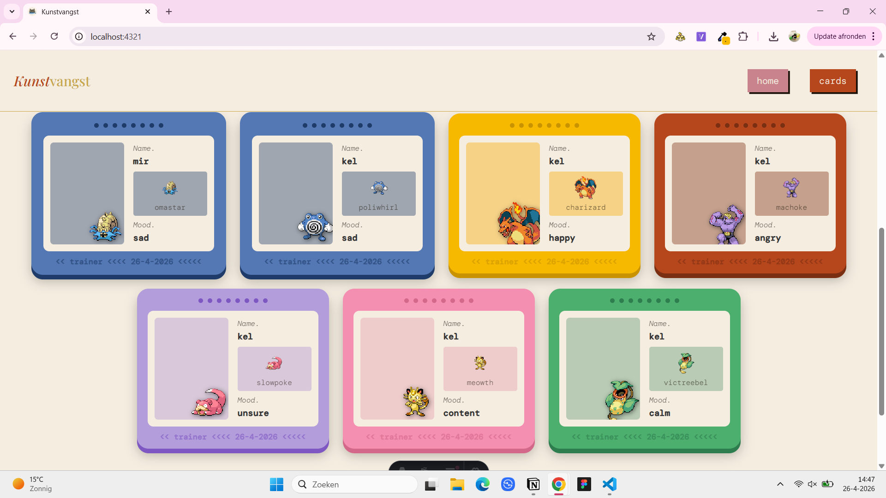
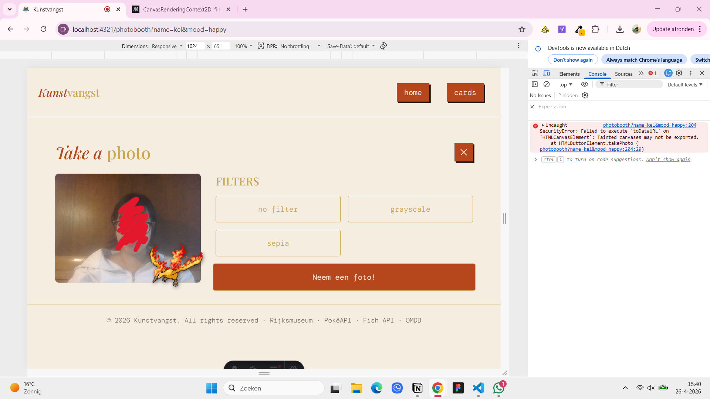

Ik heb ook geprobeerd om de pokemon al toe te voegen tijdens het maken van de foto zelf, maar dat mag niet vanuit de browser zelf.

<strong>to do list api</strong>

- photobooth
    - cancel knop linken
    - filters
    - pokemon in de frame
- huidige datum ding in de kaartje

- wekelijkse reflecties

- opmaak photobooth
- opmaak van detailpagina
- footer aanpassen
- mobile
- select